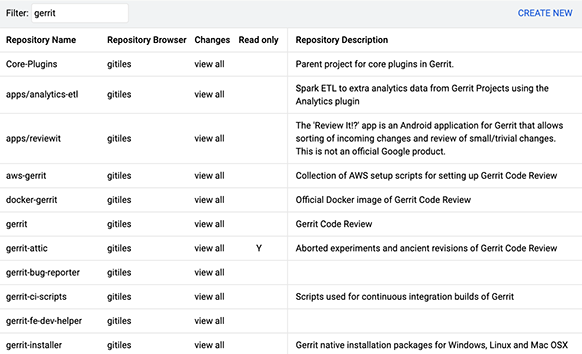
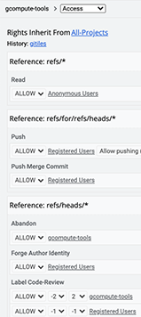
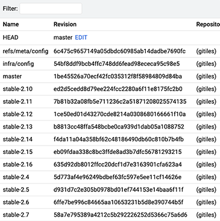

        

            

                

                    
                          <i class="fa fa-circle fa-stack-2x text-primary"></i>
                          <i class="fa fa-comments fa-stack-1x fa-inverse"></i>
                    
                

                

                    <h4>Discuss code</h4>
                    
and boost your team's code fu by talking about
                    specifics.

                    <a href="intro-gerrit-walkthrough.html" class="btn btn-primary">Learn More</a>
                

            

        

        

            

                

                    
                          <i class="fa fa-circle fa-stack-2x text-primary"></i>
                          <i class="fa fa-code-fork fa-stack-1x fa-inverse"></i>
                    
                

                

                    <h4>Serve Git</h4>
                    
As an integrated experience within the larger code
                    review flow.

                    <a href="user-dashboards.html" class="btn btn-primary">Learn More</a>
                

            

        

        

            

                

                    
                          <i class="fa fa-circle fa-stack-2x text-primary"></i>
                          <i class="fa fa-lock fa-stack-1x fa-inverse"></i>
                    
                

                

                    <h4>Manage workflows</h4>
                    
with deeply integrated and delagatable access controls.
                    

                    <a href="project-configuration.html" class="btn btn-primary">Learn More</a>
                

            

        

        

            

                

                    
                          <i class="fa fa-circle fa-stack-2x text-primary"></i>
                          <i class="fa fa-download fa-stack-1x fa-inverse"></i>
                    
                

                

                    <h4>Download</h4>
                    
Our latest release is: 
                    <b><a href="https://www.gerritcodereview.com/releases/2.15.md">2.15.1</a></b>
                    

                    <a href="https://gerrit-releases.storage.googleapis.com/gerrit-2.15.1.war" class="btn btn-primary">Download</a>
                

            

        

    

## Discuss code
Read old and new versions of files with syntax highlighting and colored
differences. Discuss specific sections with others to make the right changes.

## Manage and serve Git repositories

Gerrit includes Git-enabled SSH and HTTPS servers compatible with all
Git clients.  Simplify management by hosting many Git repositories
together.

<table>
<tr>
 <td>
 <h4>Navigate projects</h4>
 </td>
 <td>
 <h4>Control access</h4>
 </td>
 <td>
 <h4>Update branches</h4>
 </td>
</tr>
<tr>
 <td>
 
 </td>
 <td>
 
 </td>
 <td>
 
 </td>
</tr>
</table>

Schedule [git gc] over all managed repositories and [replicate] to
geographical mirrors for latency reduction and backup servers for hot
spare redundancy.

## Extensible through plugins

Gerrit Code Review can be extended and further customized by installing
[server-side plugins][plugins]. Source code for additional plugins
can be found through the [project listing](https://gerrit.googlesource.com/plugins/).

## Get in touch

<table>
<tr>
<td>
<h3>Mailing list</h3>
</td>
<td>
<h3>Social media</h3>
</td>
<td>
<h3>IRC</h3>
</td>
</tr>
<tr>
<td>
<a href="https://groups.google.com/group/repo-discuss">Repo Discuss</a>
</td>
<td>
<a href="https://plus.google.com/communities/111271594706618791655">Google+</a>
 
<a href="https://twitter.com/gerritreview">Twitter</a>
</td>
<td>
<a href="https://freenode.net">freenode</a> #gerrit
 
<a href="https://echelog.com/logs/browse/gerrit/">Channel log</a>
</td>
</tr>
</table>

