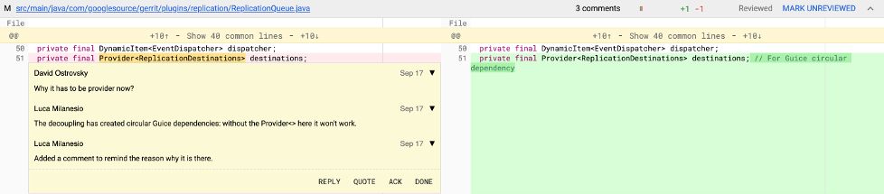

        

            

                

                    
                          <i class="fa fa-circle fa-stack-2x text-primary"></i>
                          <i class="fa fa-comments fa-stack-1x fa-inverse"></i>
                    
                

                

                    <h4>Discuss code</h4>
                    
and boost your team's code fu by talking about
                    specifics.

                    <a href="https://gerrit-review.googlesource.com/Documentation/intro-gerrit-walkthrough.html"
                       class="btn btn-primary">Learn More</a>
                

            

        

        

            

                

                    
                          <i class="fa fa-circle fa-stack-2x text-primary"></i>
                          <i class="fa fa-code-fork fa-stack-1x fa-inverse"></i>
                    
                

                

                    <h4>Serve Git</h4>
                    
As an integrated experience within the larger code
                    review flow.

                    <a href="https://gerrit-review.googlesource.com/Documentation/user-dashboards.html"
                       class="btn btn-primary">Learn More</a>
                

            

        

        

            

                

                    
                          <i class="fa fa-circle fa-stack-2x text-primary"></i>
                          <i class="fa fa-lock fa-stack-1x fa-inverse"></i>
                    
                

                

                    <h4>Manage workflows</h4>
                    
with deeply integrated and delegatable access controls.
                    

                    <a href="https://gerrit-review.googlesource.com/Documentation/project-configuration.html"
                       class="btn btn-primary">Learn More</a>
                

            

        

        

            

                

                    
                          <i class="fa fa-circle fa-stack-2x text-primary"></i>
                          <i class="fa fa-download fa-stack-1x fa-inverse"></i>
                    
                

                

                    <h4>Download</h4>
                    
Our latest release is: 
                    <b><a href="3.11.html">3.11.0</a></b>
                    

                    <a href="https://gerrit-releases.storage.googleapis.com/gerrit-3.11.0.war" class="btn btn-primary">Download</a>
                

            

        

    

## Discuss code
Read old and new versions of files with syntax highlighting and colored
differences. Discuss specific sections with others to make the right changes.

## Manage and serve Git repositories

Gerrit includes Git-enabled SSH and HTTPS servers compatible with all
Git clients.  Simplify management by hosting many Git repositories
together.

<table>
<tr>
 <td>
 <h4>Navigate projects</h4>
 </td>
 <td>
 <h4>Control access</h4>
 </td>
 <td>
 <h4>Update branches</h4>
 </td>
</tr>
<tr>
 <td>
 
 </td>
 <td>
 
 </td>
 <td>
 
 </td>
</tr>
</table>

Schedule [git gc](https://gerrit-review.googlesource.com/Documentation/config-gerrit.html#gc)
over all managed repositories and
[replicate](https://gerrit.googlesource.com/plugins/replication/+doc/master/src/main/resources/Documentation/config.md)
to geographical mirrors for latency reduction and backup servers for hot
spare redundancy.

## Extensible through plugins

Gerrit Code Review can be extended and further customized by installing
[server-side plugins](https://gerrit-review.googlesource.com/Documentation/config-plugins.html).
Source code for additional plugins can be found through the
[project listing](https://gerrit.googlesource.com/plugins/).

## Community

[Members](https://www.gerritcodereview.com/members.html) of the Gerrit community are expected to behave within the guidelines of the community's [Code Of Conduct](https://www.gerritcodereview.com/codeofconduct.html) when representing the community.  We would like to [praise](https://www.gerritcodereview.com/kudos.html) some of the more recent accomplishments from the community.

Members of the community will discuss most Gerrit related things on the [repo-discuss](https://groups.google.com/group/repo-discuss) mailing list. For a more real-time Gerrit discussion you may also join our [Discord server](https://discord.gg/HkGbBJHYbY).

Events such as user summits, hackathons, and the recurring "GerritMeets" are announced on the [repo-discuss](https://groups.google.com/group/repo-discuss) mailing list. You can also see the events posted on our [Calendar](https://calendar.google.com/calendar?cid=Z29vZ2xlLmNvbV91YmIxcGxhNmlqNzg1b3FianI2MWg0dmRpc0Bncm91cC5jYWxlbmRhci5nb29nbGUuY29t), or if you prefer to follow us on [Mastodon](https://mastodon.social/@gerritreview), [Threads](https://www.threads.net/@gerritreview), [Bluesky](https://bsky.app/profile/GerritReview.bsky.social), or [X (Formerly Twitter)](https://twitter.com/gerritreview).

For (virtual) face-to-face contributor discussions there is a monthly Gerrit contributor meeting that is hosted in Gerrit's [Discord server](https://discord.gg/3yF6HAWxg4?event=1304116092494418010). Please watch out for the 'Gerrit Contributor hangout/hacking' event there. Contributors are welcome to join and bring up topics they would like to discuss or changes they need help with. The agenda is set as an open time block for Gerrit contributors to join each other online to collaborate on changes, challenges, roadmap items, etc.

## Support

Please refer to the [support](support.html) page for more details.

## Training Slides

These have been moved to the [Presentations](https://www.gerritcodereview.com/presentations.html)
page under Community. More presentations are made available there as well.
