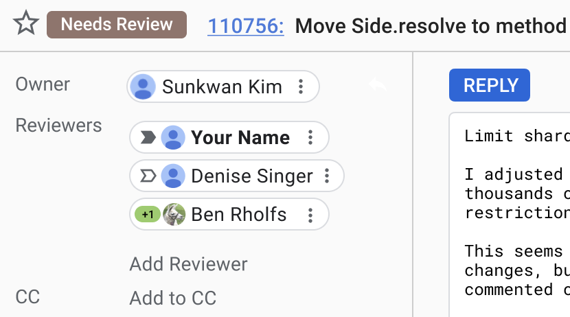
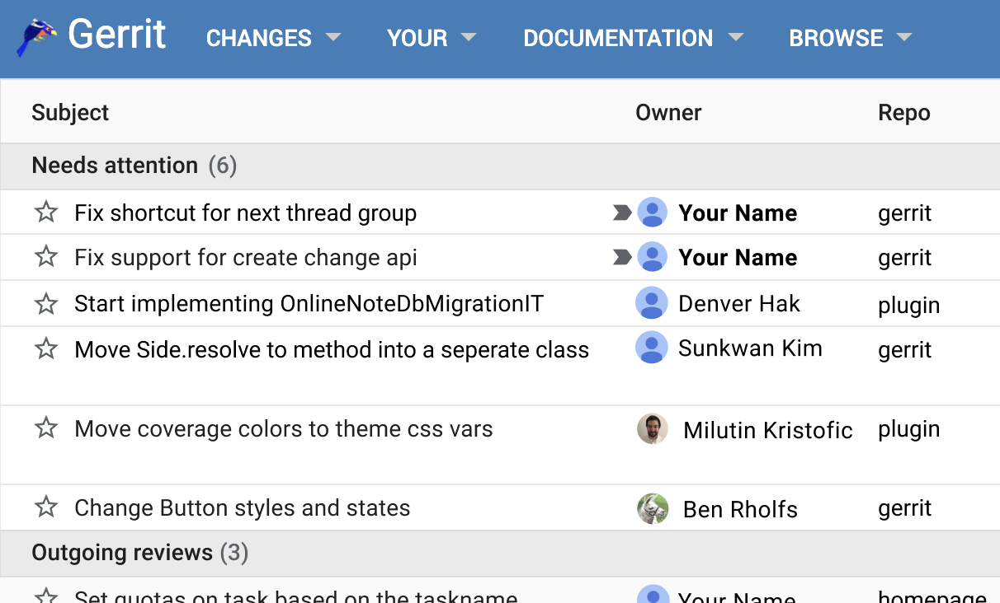
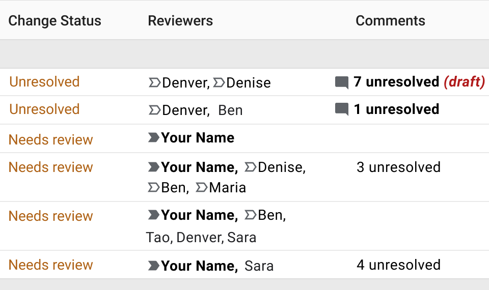
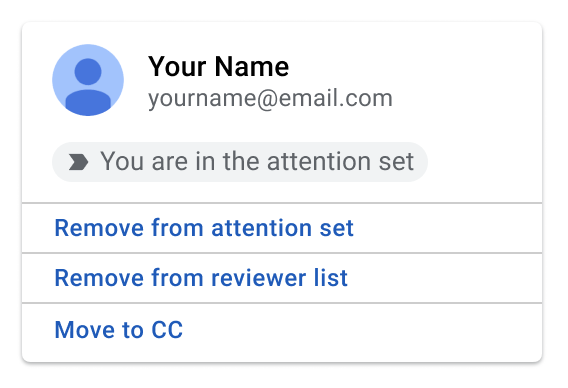
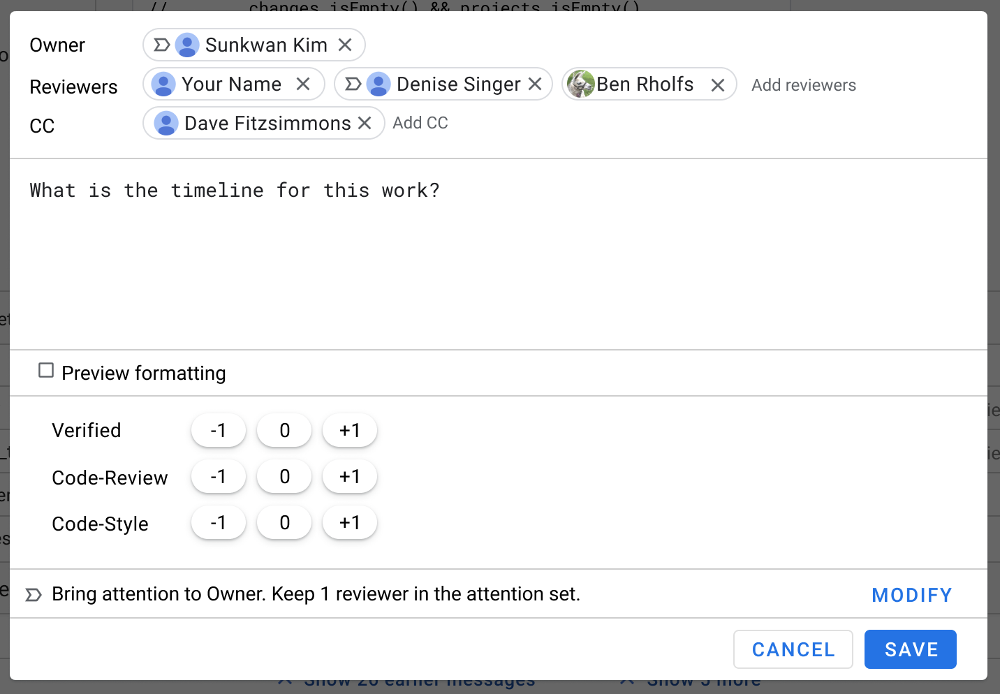
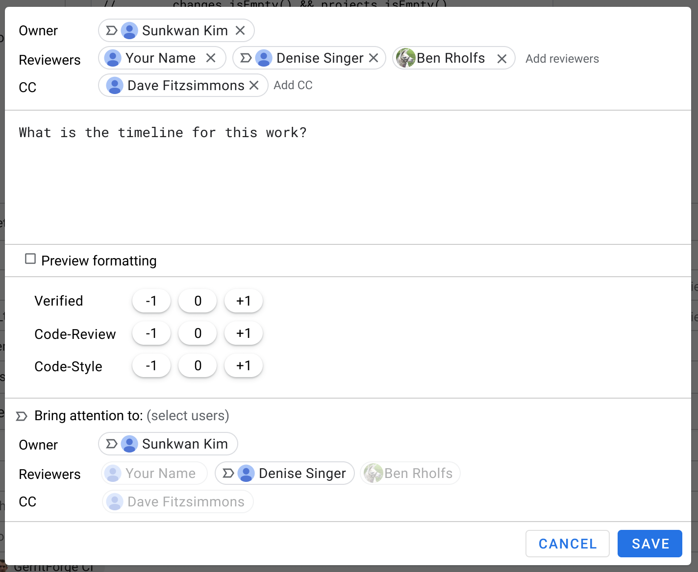

*Please read these other parts of the solution before this doc:*

*   [Use Cases](use-cases.md)
*   [Workflow](solution-1-workflow.md)

# Solution 1 - User Interface

The design of the user interface will be developed iteratively. So the details of what is proposed
and shown here may well change. The mocks are just here to illuminate the proposal with some
concrete examples.

On the dashboard and on the change page users that are expected to take action will be highlighted
by some kind of arrow icon next to their username.

We will add a new section at the top of every dashboard called "Needs Attention" that displays all
changes that currently need attention from the user, including both incoming and outgoing reviews.

The "Status" column of the dashboard will be refined and columns for "Reviewers" and "Comments" will
be added.

Hovering over or clicking a username or the arrow (TBD: How to do this without a mouse?) will open
a dialog with the following functionality:

*   Adding or removing the user to/from the attention set.
*   Showing the timestamp and the name of event of when someone was added to the attention set.

The reply dialog will contain a section for showing the
[default changes](solution-1-workflow.md#defaults) applied to the attention set when clicking
"Send", and it will allow to modify them.

