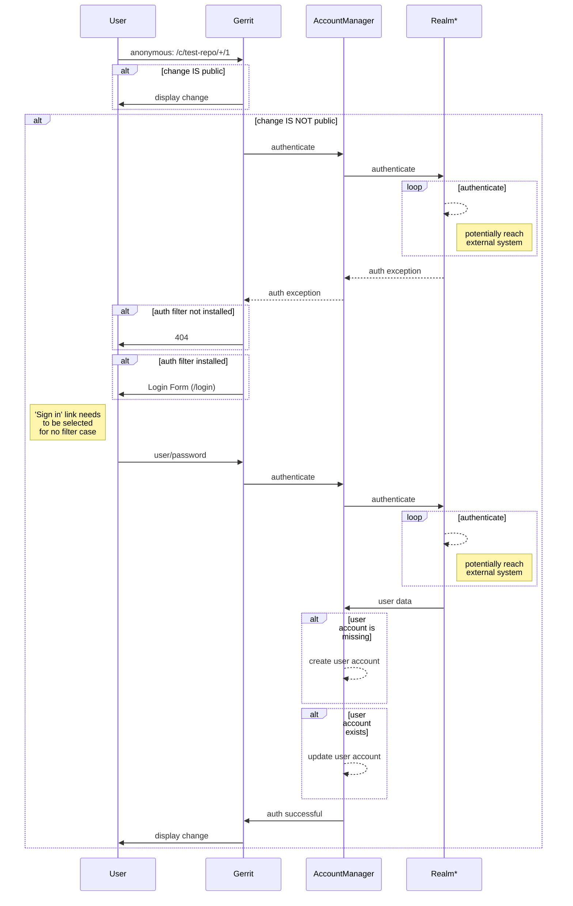

```mermaid
sequenceDiagram
User->>Gerrit: anonymous: /c/test-repo/+/1
alt change IS public
  Gerrit->>User: display change
end
alt change IS NOT public
  Gerrit->>AccountManager: authenticate
  AccountManager->>Realm*: authenticate
  loop authenticate
    Realm*-->>Realm*: 
    Note right of Realm*: potentially reach<br/>external system
  end
  Realm*-->>AccountManager: auth exception
  AccountManager-->>Gerrit: auth exception
  alt auth filter not installed
    Gerrit->>User: 404
  end
  alt auth filter installed
    Gerrit->>User: Login Form (/login)
  end
  Note left of User: 'Sign in' link needs<br/>to be selected<br/>for no filter case
  User->>Gerrit: user/password
  Gerrit->>AccountManager: authenticate
  AccountManager->>Realm*: authenticate
  loop authenticate
    Realm*-->>Realm*: 
    Note right of Realm*: potentially reach<br/>external system
  end
  Realm*->>AccountManager: user data
  alt user account is missing
    AccountManager-->>AccountManager: create user account
  end
  alt user account exists
    AccountManager-->>AccountManager: update user account
  end
  AccountManager->>Gerrit: auth successful
  Gerrit->>User: display change
end
```
