# Solution - Auth Extension Points

## <a id="overview"> Overview

At present only single auth method can be enabled (plus SSH when `--disable-sshd`
is not set) at the time. However all auth methods but `CUSTOM_EXTENSION` provide
login form on `"/login", "/login/*"` path either through a servlet (`HTTP*`,
`LDAP*`, etc.) or a filter (`OAUTH`, `OPENID*`) implementation. IOW some auth
methods result in redirection to the login form when user sign in is required
whereas the others (without a filter) expects that user clicks `Sign in` link again.

The following diagram describes both authentication and user account creation/update:
 that happens when user gets authenticated.

Note that different auth methods contribute different
[Realm](https://gerrit.googlesource.com/gerrit/+/refs/heads/master/java/com/google/gerrit/server/account/Realm.java)
implementation (denoted by `*` next to its name). But this is not an extension
point hence it cannot be contributed outside of the Gerrit core.

Most of the methods (again but `CUSTOM_EXTENSION`) contribute almost the same
login path (`/login`, `/login/*`, etc.). Which could be unified under generic
`AuthenticationServlet` servlet registration (similar to LFS path) that calls
specific auth logic (resulting in a call to `Realm.authenticate`) and gets the
dedicated form implementation. Plugin forms are provided in the same fashion now.

According to the above auth extention point should deliver 3 auth components:
* `Realm` (to authenticate and retrieve user data)
* authentication logic
* sign-in form

Another limitation that exists in the current code is inability to enable
more then one authentication method. Enabling that requires the change to the
way auth gets configured (auth tokens could potentially be represented as auth
subsections or multi-value token - to be specified later).

## <a id="detailed-design"> Detailed Design

TBD

### <a id="scalability"> Scalability

TBD

## <a id="alternatives-considered"> Alternatives Considered

TBD

## <a id="pros-and-cons"> Pros and Cons

TBD

## <a id="implementation-plan"> Implementation Plan

Remove 
[AuthBackend](https://gerrit.googlesource.com/gerrit/+/refs/heads/master/java/com/google/gerrit/server/auth/AuthBackend.java)
to get out of split-brain scenario that exists in current code base.

Enhance
[Realm](https://gerrit.googlesource.com/gerrit/+/refs/heads/master/java/com/google/gerrit/server/account/Realm.java)
to extension point so that it can be fully implemented in the plugin.
`AuthBackend` capabilities should be merged to `Realm`.

TBC

## <a id="time-estimation"> Time Estimation

TBD
