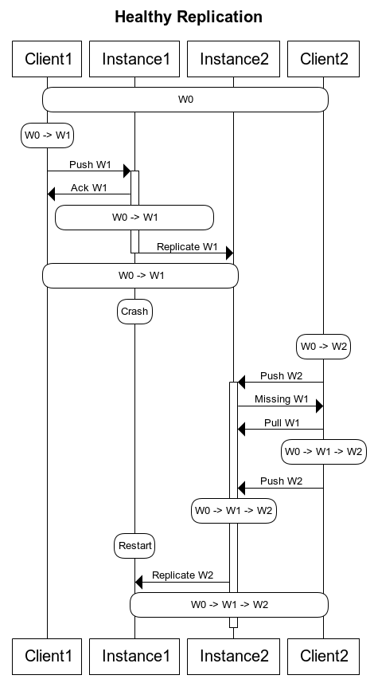
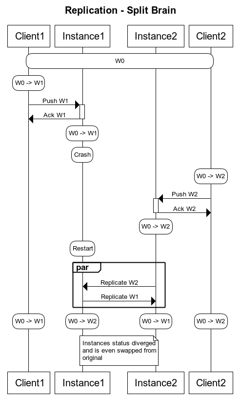
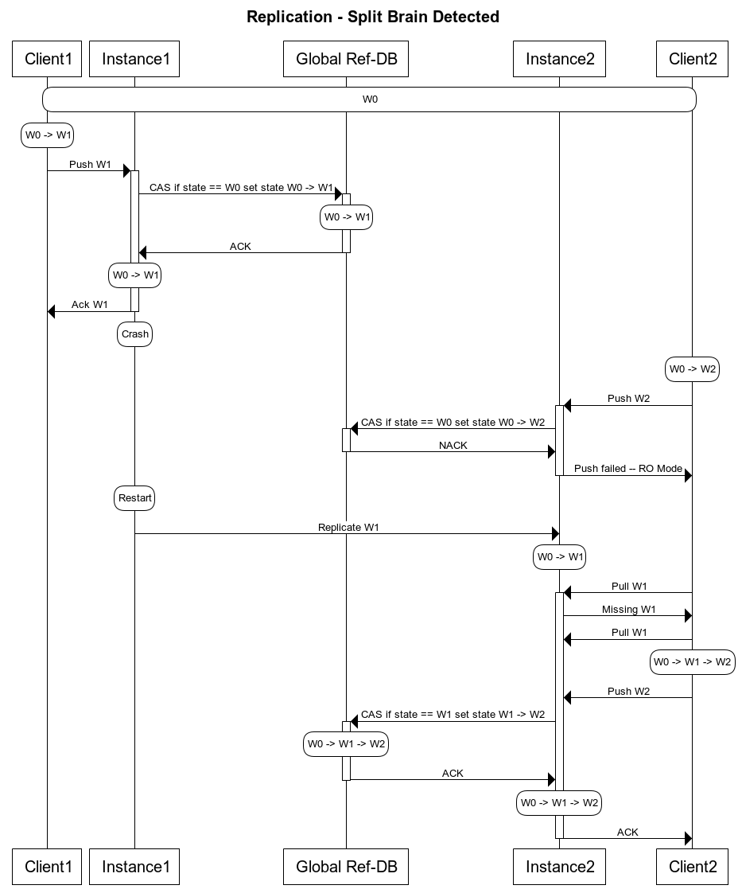

# Use-case

Global Ref-DB ensures correct alignment of refs of the multi nodes setup. This is achieved by storing the most recent `sha` for each
specific mutable `refs`, by the usage of some sort of atomic _Compare and Set_ operation. It also enables concurrent writes on a multi-master setup by enabling a shared locking
mechanism for refs across multiple nodes.

### Primary use case:

Enable detection of out-of-sync refs across gerrit sites. Each change attempting
to mutate a ref will be checked against the Ref-DB to guarantee that each node has
an up-to-date view of the repository state.

Split-brain prevention is a great example of how detection of out-of-sync refs can be used in real life scenario:

#### The diagram below illustrates the happy path with crash recovery returning the system to a healthy state.

In this case we are considering two different clients each doing a `push` on top of
the same reference. This could be a new commit in a branch or the change of an existing commit.

At `t0`: both clients see the status of `HEAD` being `W0`. `Instance1` is the
RW node and will receive any `push` request. `Instance1` and `Instance2` are in sync
at `W0`.

At `t1`: `Client1` pushes `W1`. The request is served by `Instance1` which acknowledges it
and starts the replication process (with some delay).

At `t2`: The replication operation is completed. Both instances are in a consistent state
`W0 -> W1`. `Client1` shares that state but `Client2` is still behind.

At `t3`: `Instance1` crashes.

At `t4`: `Client2` pushes `W2` which is still based on `W0` (`W0 -> W2`).
The request is served by `Instance2` which detects that the client push operation was based
on an out-of-date starting state for the ref. The operation is refused. `Client2`
synchronises its local state (e.g. rebases its commit) and pushes `W0 -> W1 -> W2`.
That operation is now considered valid, acknowledged and put in the replication queue until
`Instance1` becomes available.

At `t5`: `Instance1` restarts and is replicated at `W0 -> W1 -> W2`

#### The Split Brain situation is illustrated in the following diagram.

In this case the steps are very similar except that `Instance1` fails after acknowledging the
push of `W0 -> W1` but before having replicated the status to `Instance2`.

When in `t4` `Client2` pushes `W0 -> W2` to `Instance2`, this is considered a valid operation.
It gets acknowledged and inserted in the replication queue.

At `t5` `Instance1` restarts. At this point both instances have pending replication
operations. They are executed in parallel and they bring the system to divergence.

Root causes of the Split Brain problem:
- The RW node acknowledges a `push` operation before __all__ replicas are fully in sync.
- The other instances are not aware that they are out of sync.

#### Prevent split brain thanks to Global Ref-DB

The above scenario can be prevented by using an implementation of the Global Ref-DB
interface, which will operate as follows:

The difference, in respect to the split brain use case, is that now, whenever a change of a
_mutable ref_ is requested, the Gerrit server verifies with the central RefDB that its
status __for this ref__ is consistent with the latest cluster status. If that is true
the operation succeeds. The ref status is atomically compared and set to the new status
to prevent race conditions.

In this case `Instance2` enters a Read Only mode for the specific branch
until the replication from `Instance1` is completed successfully. At this point write
operations on the reference can be recovered.
If `Client2` can perform the `push` again vs `Instance2`, the server recognises that
the client status needs an update, the client will `rebase` and `push` the correct status.

### Secondary use cases:

1. Global ref-db helps sharing the repositories refdb across all the nodes when
Gerrit masters or slaves shares repos over a shared storage (e.g. NFS).
2. It could be leveraged also to have concurrent writes on a multi-master
setup(the high-availability scenario) by enabling a shared locking
mechanism for refs across multiple nodes.

## <a id="acceptance-criteria"> Acceptance Criteria

Gerrit or other plugins can use global ref-db provided as a plugin.

## <a id="background"> Background

First implementation of the global ref-db was designed and implemented for the
multi-site plugin. Original design document can be found [here](
https://gerrit.googlesource.com/plugins/multi-site/+/refs/heads/master/DESIGN.md).
